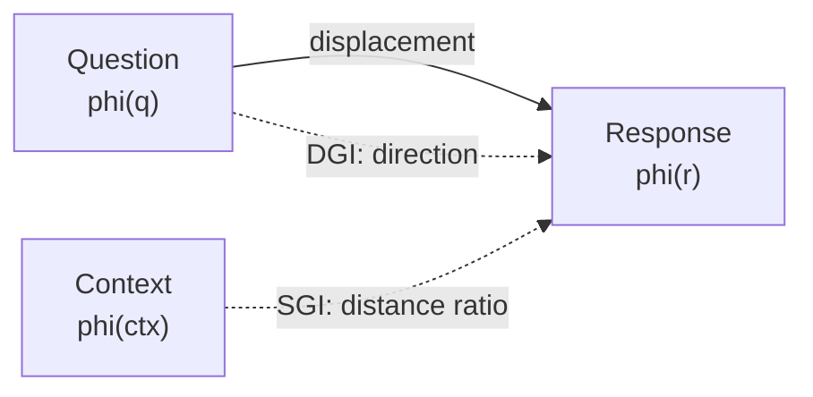
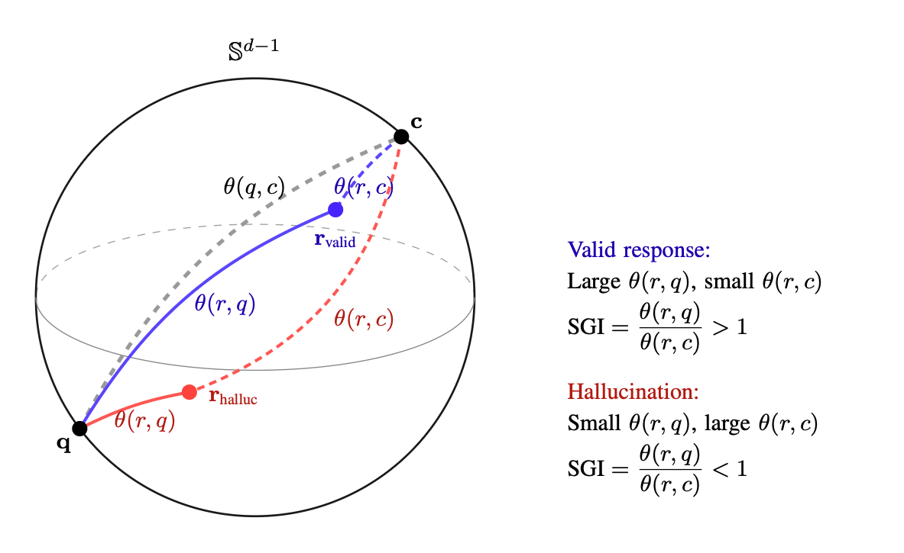
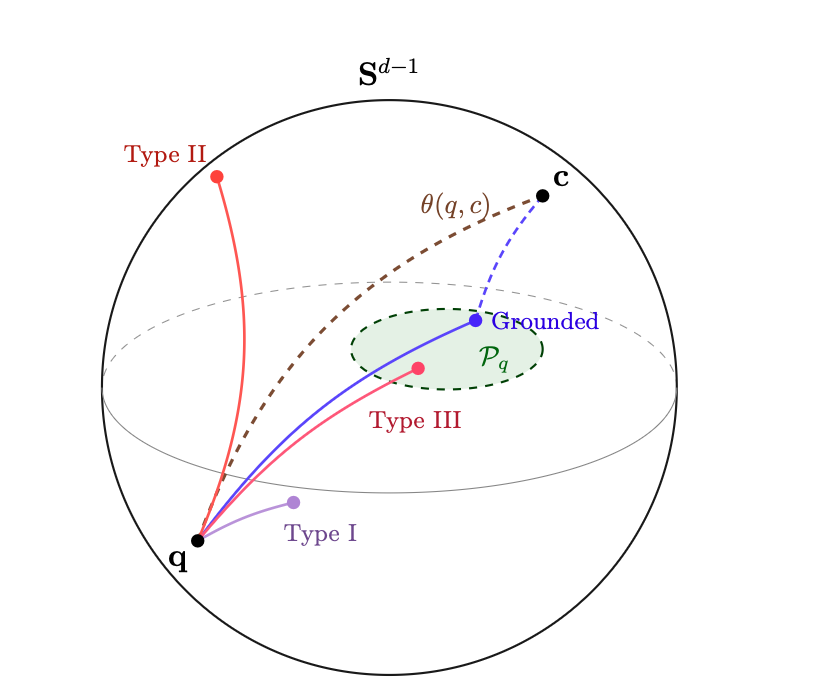

# How It Works

factlens detects hallucinations by analyzing the **geometry** of text embeddings. Instead of asking a second LLM "is this answer correct?" (which is itself susceptible to hallucination), factlens computes deterministic geometric scores in embedding space.

## The Core Idea

Every piece of text --- a question, a context document, an LLM response --- can be mapped to a point in a high-dimensional vector space using a sentence transformer. In this space, texts with similar meaning are close together; texts with different meaning are far apart.

factlens exploits two geometric properties of this space:

1. **Distance ratios** (SGI): If a response truly engaged with the source context, it should be geometrically closer to that context than to the bare question.
2. **Displacement directions** (DGI): Grounded responses create a characteristic "direction of movement" from question to answer. Hallucinations move in different directions.

## The Embedding Space

factlens uses sentence transformers (default: `all-mpnet-base-v2`) to map text into $\mathbb{R}^{768}$. In this space:

- Each text becomes a 768-dimensional vector
- Semantic similarity correlates with geometric proximity
- The space has rich structure: clusters for topics, gradients for specificity, and characteristic directions for question-answer relationships

!!! info "Why sentence transformers?"
    Sentence transformers are specifically trained (via contrastive learning) to place semantically similar texts nearby and dissimilar texts far apart. This is exactly the property factlens needs --- the geometric structure encodes semantic relationships.

## SGI: Distance Ratios

<figure markdown="span">
  { width="700" }
  <figcaption>Angular geometry of SGI on the unit hypersphere. A valid response (blue) departs from q toward c, yielding SGI > 1. A hallucination (red) remains angularly proximate to the question, yielding SGI < 1.</figcaption>
</figure>

When context is available, SGI asks: **is the response closer to the context or to the question?**

$$
\text{SGI} = \frac{\|\phi(r) - \phi(q)\|}{\|\phi(r) - \phi(\text{ctx})\|}
$$

- If SGI > 1, the response is closer to the context (grounded)
- If SGI < 1, the response is closer to the question (possibly ignoring context)

This captures a fundamental intuition: a grounded response should semantically resemble the source material more than it resembles the question that prompted it.

## DGI: Displacement Directions

<figure markdown="span">
  { width="700" }
  <figcaption>Geometric taxonomy of hallucination types on the embedding hypersphere. Type I (purple) stays near the question. Type II (red) departs to an unrelated direction. Type III (pink) lands inside the grounded region but is factually incorrect — the confabulation boundary.</figcaption>
</figure>

When no context is available, DGI analyzes the **direction** of semantic movement from question to response:

$$
\delta = \phi(r) - \phi(q), \quad \text{DGI} = \frac{\delta}{\|\delta\|} \cdot \hat{\mu}
$$

where $\hat{\mu}$ is a reference direction learned from verified grounded (question, response) pairs.

The insight: grounded responses tend to move in a consistent direction in embedding space (toward factual elaboration). Hallucinations move in different, less consistent directions.

## Normalization

Raw scores are normalized to [0, 1] for convenience:

| Method | Raw range | Normalization | Mapping |
|---|---|---|---|
| SGI | [0, +inf) | $\tanh(\max(0, \text{SGI} - 0.3))$ | Sigmoid-like curve |
| DGI | [-1, 1] | $(\text{DGI} + 1) / 2$ | Linear mapping |

## Thresholds

factlens uses empirically-derived thresholds to flag responses:

| Threshold | Value | Meaning |
|---|---|---|
| `SGI_STRONG_PASS` | 1.20 | Strong context engagement |
| `SGI_REVIEW` | 0.95 | Below this: flagged for review |
| `DGI_PASS` | 0.30 | Above this: aligned with grounded patterns |

!!! warning "Thresholds are for triage, not for truth"
    factlens scores are verification triage signals --- they help you prioritize which outputs need human review. A high score does not guarantee factual accuracy; a low score does not guarantee hallucination. The value is in **efficiently directing human attention** to the outputs most likely to need it.

## What factlens Cannot Do

- **Verify factual truth**: factlens measures geometric properties of embeddings, not correspondence to external reality.
- **Detect human-crafted confabulations**: Deliberately constructed false statements that mimic grounded patterns can fool DGI (see [Confabulation Boundary](../theory/confabulation-boundary.md)).
- **Replace human review**: factlens is a triage tool. It tells you *where to look*, not *what is true*.

## Next Steps

- [SGI Deep Dive](sgi.md) --- formula, thresholds, geometric interpretation
- [DGI Deep Dive](dgi.md) --- reference direction, calibration, von Mises-Fisher
- [Embedding Geometry Theory](../theory/embedding-geometry.md) --- the mathematics behind the embeddings
